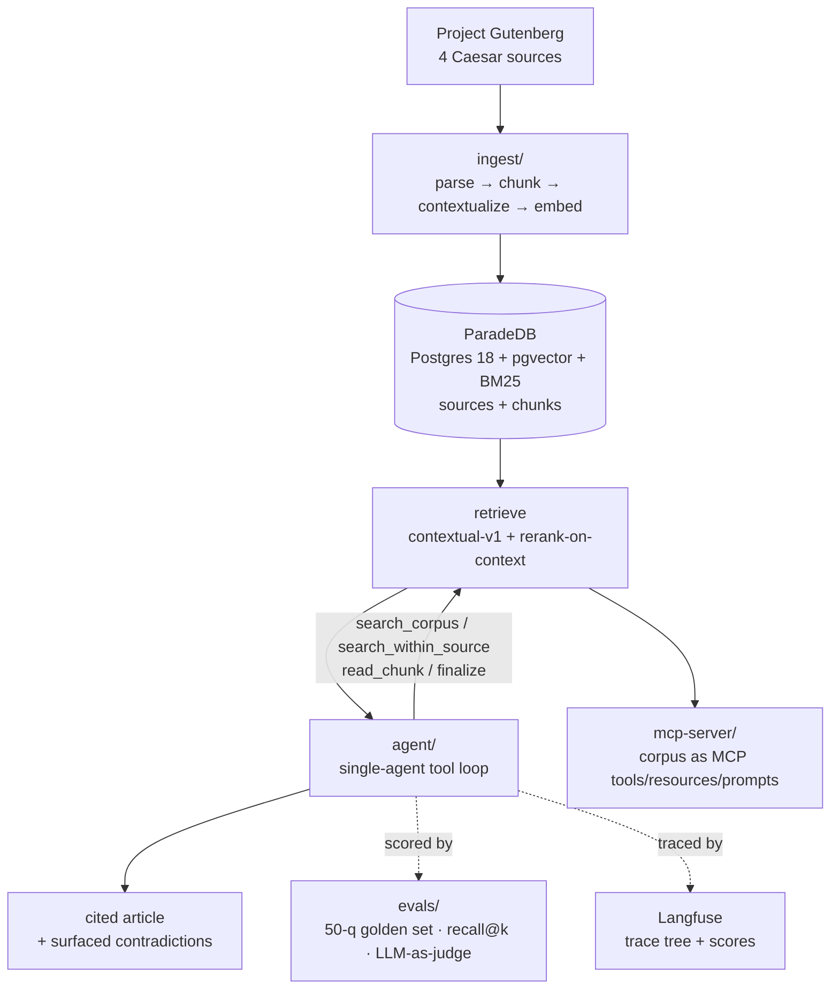

# rag-historian — The Roman Research Agent

An **eval-driven** agentic research assistant over a curated corpus of Julius Caesar
primary sources. It answers questions about Caesar's career, the Gallic and Civil
Wars, his dictatorship and his death — from the sources, with citations — and its
headline feature is **surfacing contradictions** across sources rather than blending
them into one smoothed answer.

This repository is the **Phase 1 case study** of an AI-engineering foundation built
in TypeScript. The point was never "ship a chatbot." It was to build every layer by
hand — LLM client, RAG, evals, agent, MCP server, production patterns — and to make
**every claim a measured one**. The numbers below are reproducible from this repo.

> **Headline result.** A single-agent research loop over a retrieval stack tuned by
> isolated A/B testing lifts answer **completeness from 3.12 → 4.62 / 5** across the
> journey, with the biggest gains exactly where they were predicted to be hardest —
> multi-source **synthesis (+1.13)** and **contradiction (+0.78)**. Each step of that
> climb was gated on a 50-question golden set, and roughly as many techniques were
> **rejected with evidence** as were adopted.

---

## Contents

- [The problem](#the-problem)
- [Architecture](#architecture)
- [The method: eval-driven, one change at a time](#the-method-eval-driven-one-change-at-a-time)
- [The journey, with measured impact](#the-journey-with-measured-impact)
  - [Module 4 — Naive RAG baseline](#module-4--naive-rag-baseline)
  - [Module 5 — Evals (the differentiator)](#module-5--evals-the-differentiator)
  - [Module 6 — Advanced RAG: the comparison table](#module-6--advanced-rag-the-comparison-table)
  - [Module 7 — The agent](#module-7--the-agent)
  - [Module 8 — MCP server](#module-8--mcp-server)
  - [Module 9 — Production patterns](#module-9--production-patterns)
- [The final result: Haiku vs Sonnet](#the-final-result-haiku-vs-sonnet)
- [Cost & latency](#cost--latency)
- [Lessons that travel](#lessons-that-travel)
- [Reproduce it](#reproduce-it)
- [Repo layout](#repo-layout)

---

## The problem

Retrieval over a **historical corpus** is harder than the typical "search the docs"
RAG demo, for three reasons this project leans into:

1. **Vocabulary drift.** A reader asks about "epilepsy"; the 1st-century source says
   "the falling sickness." A reader asks how Caesar gained "absolute power"; the text
   says *dictator perpetuo*. The question and the answer rarely share words.
2. **The answer is distributed.** "What were the political tensions between Pompey and
   Cicero?" has no single passage that contains it — the answer must be assembled from
   many.
3. **The sources disagree, and that disagreement is the point.** Caesar wrote about his
   own wars *during* them; Plutarch and Suetonius wrote 150–170 years later from
   different cultural angles. On the crossing of the Rubicon, on Caesar's last words, on
   whether he wanted to be king, they diverge. A good historian's assistant **shows both
   accounts and names who said what** — it does not pretend they agree.

The corpus is deliberately **tight and overlapping** — four primary sources, ~1.25 MB
/ ~314k tokens / 950 chunks — because overlap on a focused topic is what makes
contradiction-handling a real, testable feature rather than a slogan.

| Source | Author | Tier | Written | Vantage |
|---|---|---|---|---|
| The Gallic War | Caesar | primary | ~50 BC | First-person, during the campaigns. Self-serving. |
| The Civil War | Caesar | primary | ~48 BC | First-person, fighting Pompey. |
| Life of Caesar (*Parallel Lives*) | Plutarch | primary | ~75–100 AD | Greek biographer, ~150 yrs later. Moralizing. |
| Life of Julius Caesar (*Twelve Caesars*) | Suetonius | primary | ~120 AD | Roman gossip historian, ~170 yrs later. Vivid. |

All Project Gutenberg public-domain English translations.

---

## Architecture



**Stack.** Node 20 / TypeScript (strict, ESM) · pnpm · `tsx` (no build step) · Biome.
**LLMs:** Anthropic SDK (Claude Haiku/Sonnet/Opus) for frontier; **llama.cpp via
llama-swap** for local Qwen3.5-9B chat, **bge-m3** embeddings, and **bge-reranker-v2-m3**
reranking — one local endpoint serves all three. **DB:** ParadeDB (Postgres 18 +
pgvector + `pg_search` BM25). **Evals:** custom harness + Promptfoo. **Tracing:**
self-hosted Langfuse. **No frameworks** (LangChain/LangGraph/CrewAI/Vercel AI SDK) —
the client, the RAG, the agent loop, the MCP server are all built by hand. That was the
explicit point of the foundation.

---

## The method: eval-driven, one change at a time

A single "is the answer good?" score is useless for diagnosis. The harness splits the
pipeline at **five independent measurement points**:

```
question → [embed] → [pgvector/BM25 top-k] ──► RECALL@k, MRR   (did retrieval find the gold?)
                                  │
                                  ▼ (top-5 to generator / agent)
                           [generate / agent loop]
                                  │
                                  ├─► FAITHFULNESS   (does every claim trace to a chunk?)
                                  ├─► COMPLETENESS   (vs the ideal answer)
                                  └─► REFUSAL CORR.  (refuse vs answer, as expected?)
```

When faithfulness is high but completeness is low, you *know* the model isn't
hallucinating — retrieval simply isn't surfacing enough. That's an attribution claim no
single score can make, and it's what drove every decision below.

**The golden set** (`evals/golden-set.json`) is 50 hand-reviewed
question / ideal-answer / gold-span triples across six categories:

| Category | n | What it tests |
|---|---:|---|
| literal | 9 | Basic vector retrieval — the easy case |
| synonym | 8 | Vocabulary mismatch ("falling sickness" = epilepsy) |
| multi-hop | 9 | Combining facts from different chunks |
| synthesis | 8 | Reasoning across many sources; the answer is distributed |
| **contradiction** | 9 | Cross-source disagreement — the project's headline feature |
| out-of-scope | 7 | Refusal — empty gold, the system must decline |

Gold is stored as **character spans**, not chunk IDs, so it stays valid when chunking
changes — you can A/B a new chunker against the same gold without re-labelling. Two
disciplines held throughout: **change one thing at a time**, and **A/B every change
against the previous best**.

---

## The journey, with measured impact

### Module 4 — Naive RAG baseline

500-token chunks, bge-m3 embeddings, cosine top-5, stuff-and-cite. It worked, and its
failure modes were instructive: **token-frequency bias** (Suetonius §I "Caesar's birth"
outranked topically relevant passages because *"Julius Caesar"* appears in its first
line), **off-topic noise** in the top-5, and **multi-hop questions failing by design**
(vector search matches the *whole* question, not its sub-facts). Subjective quality
~3/5 — visibly retrieval-bottlenecked. That bottleneck became the Module 6 target list.

### Module 5 — Evals (the differentiator)

Built the harness above: recall@k / MRR on span gold, three LLM-as-judge rubrics, and a
Promptfoo cross-check. **Baseline numbers locked in:** recall@5 **35.1%**, recall@20
**55.4%**, MRR **0.475**; Haiku completeness **3.12**, faithfulness 4.86, refusal 84%.
This is the "before" picture every later technique is measured against. The category
breakdown already predicted the war: **synthesis was the weakest retrieval (18.7%
recall@5)** and **contradiction the strongest (55.6%)** — a hint that the hard problems
would turn out to be *generation*, not retrieval.

### Module 6 — Advanced RAG: the comparison table

Six techniques, each implemented, A/B'd against the previous best, and given a verdict
*with its reason*. **Two were adopted; four were rejected or de-scoped with evidence** —
which is the whole value of an eval harness.

| Stack (cumulative along the kept path) | recall@5 | recall@20 | MRR | Verdict |
|---|---:|---:|---:|---|
| Naive baseline | 35.1% | 55.4% | 0.475 | — |
| + structure-aware chunking | 35.1% | 55.4% | 0.475 | ❌ no change — naive already optimal |
| + reranking (cross-encoder) | 45.0% | 60.7% | 0.515 | ✅ adopt — biggest pre-contextual lever |
| + hybrid BM25 **and** rerank | 45.0% | 64.0% | 0.513 | ❌ ties vector+rerank @5 → drop hybrid |
| + contextual retrieval | 51.0% | 68.4% | 0.552 | ✅ adopt — the single biggest lever |
| **+ rerank-on-context ← FINAL** | **51.6%** | **70.5%** | **0.568** | ✅ best on every metric |
| ~~+ HyDE~~ | 41.9% | 66.9% | 0.499 | ❌ reject — −9.7, wrong tool for a small corpus |
| + query expansion (n=5) | 53.7% | 74.0% | 0.570 | 🔶 opt-in flag, not default |

**What won, and why.** *Contextual retrieval* (an LLM writes a 1–2 sentence note naming
the people/places a chunk only implies, embedded with the chunk) was the lever:
literal recall@5 28.7 → 76.9. Our chunks had lost their referents — "he crossed at dawn"
never says *Rubicon* — and the note injects them back. *Rerank-on-context* was the
multiplier, and taught the deepest lesson: reranking the **bare** chunk text *hurt*
(51.0 → 47.9) because the cross-encoder saw un-contextualized text and demoted exactly
the chunks contextual embedding had surfaced. Feeding the reranker the *same*
contextualized text flipped it to best-on-every-metric. **A two-stage pipeline must
share representation, or the stages fight.**

**What lost, and why it mattered to know.** Structure-aware chunking — naive was already
optimal. Hybrid BM25 — genuinely works, but a strong reranker *subsumes* it at k=5.
HyDE — replaces the question's discriminative terms, craters synonym recall; the right
tool for a large diverse corpus, the wrong one for a small single-topic one. And the
finding that set up the rest of the project: **synthesis stayed ~22.9% recall@5 under
*every* retrieval lever.** Synthesis gold is relevant only in aggregate — invisible to a
(question, single-chunk) matcher. That proved synthesis and contradiction are
**generation problems, not retrieval problems** — and pointed straight at an agent.

### Module 7 — The agent

A **single-agent tool loop** (no LangGraph) over the Module 6 retrieval stack, with five
tools — `search_corpus`, **`search_within_source`** (the contradiction lever, reads each
source in isolation), `read_chunk`, `list_sources_consulted`, `finalize`. The thesis:
multi-step *search → read each source → contrast* beats single-shot retrieval on exactly
the reasoning-bound categories Module 6 couldn't fix.

**It did, for both a frontier and a local model** (Haiku-judged, agent vs the Module 6
single-shot stack):

| metric | single-shot Haiku | **agent Haiku** | single-shot qwen-9b | **agent qwen-9b** |
|---|---:|---:|---:|---:|
| Completeness | 3.40 | **4.04** | 3.02 | **3.38** |
| Faithfulness | 4.64 | **4.72** | 3.98 | **4.32** |
| Refusal acc. | 92% | **98%** | — | 90% |

The most valuable findings were about **the eval being part of the system under test** —
three *measurement* bugs each moved the numbers more than most real changes:

- **Citation scheme.** The faithfulness judge labelled evidence `[1]..[N]` while the
  agent cited by `chunk_id`, so correct citations read as fabricated. Fixing it recovered
  **~+0.38 faithfulness**.
- **Forced-finalize.** A budget-exhausted run returned empty text and scored as a
  non-answer; making it synthesize from what it had gathered lifted completeness +0.89 on
  the literal slice.
- **Judge calibration (the big one).** A Haiku judge *systematically under-scored*
  thorough multi-source answers and could not be prompted out of it. Swapping to a
  **Sonnet judge** corrected contradiction 3.00 → 3.89 *and* revealed the Haiku judge had
  been too *lenient* on synthesis (4.00 → 3.50). Per Hamel's rule — **the judge must be at
  least as strong as the generator** — Sonnet became the default judge from here on.

The other lesson: **prompt-tuning has a noise floor; model swaps clear it.** Two
data-motivated contradiction prompt fixes both landed *within* per-question variance
(±1–2 at n=9) and were reverted. A Sonnet spot-check moved the same hard questions +1.5
to +3. That set up the final experiment below.

### Module 8 — MCP server

The corpus exposed as a Model Context Protocol server (stdio) — **tools**
(`search_roman_corpus`, `read_roman_chunk`, `list_roman_sources`, `cite_passage`),
**resources** (each book + chapter listings), and **prompts** (`research_topic`,
`summarize_event`). Wired into Claude Code via `.mcp.json` and smoke-tested. The
load-bearing footgun: **stdout is the JSON-RPC channel** — every log line must go to
stderr or it corrupts the protocol.

### Module 9 — Production patterns

The operational layer that turns the agent from a demo into something production-grade.
The module's discipline (and its pitfall): **patterns that change outputs ship only if a
before/after A/B justifies them; patterns that only change cost/reliability are measured
on those axes** — and every gate reused existing artifacts, so the whole module cost
cents.

| Pattern | What shipped | Measured result |
|---|---|---|
| **Prompt caching** | rolling-transcript + system/tools cache in the tool loop | ~**2× lower** per-question cost ($0.037 → $0.019); proven by 10.5k cache-read tokens |
| **Cross-provider fallback** | `createFallbackClient` chain Claude → local Qwen | break-key demo: a 401 fell through to a full agent loop on Qwen at **$0** |
| **Rate limiting** | token-bucket + semaphore for proactive batch pacing | concurrency cap + FIFO spacing verified |
| **Model routing** | Haiku classifier (escalation-biased) → Haiku \| Sonnet, scored against gold categories | 74% accuracy, only **3/26 dangerous misroutes** — low quality risk; *ship decision deferred to the final A/B below* |
| **Guardrails** | input (injection/length) + output (citation) validators, wired into the agent | **0 false positives** on 50 golden Qs, 7/7 attacks caught, flagged the 1 known leak |
| **Prompt versioning** | Langfuse-managed prompt + in-code fallback | live v1/v2 + label rollback verified; falls back to the committed const if Langfuse is down |

Notably, **no runtime fact-check guardrail** was built — the faithfulness judge already
measures grounding offline, and a per-answer re-check would double cost to re-measure
something we can't show changes outputs. Knowing what *not* to add is a production skill
too.

---

## The final result: Haiku vs Sonnet

Module 7 proved the next dollar should go on the **model**, not more prompt text. So the
closing experiment runs the full agent on all 50 questions with **Claude Sonnet 4.6** as
the driver and **Sonnet as the judge** — "best quality possible" — against the Haiku
agent baseline.

**Completeness is the clean comparison (both Sonnet-judged):**

| metric | Haiku agent | **Sonnet agent** | Δ |
|---|---:|---:|---:|
| **Completeness** | 4.24 | **4.62** | **+0.38** |
| Faithfulness | 4.72 † | 4.40 † | −0.32 † |
| Refusal accuracy | 98% | 96% | −2 |
| Avg tool calls / q | 6.9 | 8.3 | +1.4 |
| Gold coverage | 76% | 80% | +4 |
| Generator cost / 50q | $1.28 | $2.01 | 1.6× |
| Avg latency / q | 26.8 s | 30.7 s | +4 s |

<sub>† Faithfulness is **not** strictly comparable — the Haiku baseline's faithfulness was
Haiku-judged; the Sonnet run is fully Sonnet-judged (a stricter, more discriminating
judge). Completeness and refusal are judge-consistent.</sub>

**The win scales with reasoning difficulty** — and lands hardest on the two categories
Module 6 and 7 flagged as the open gaps:

| category | Haiku C | Sonnet C | Δ |
|---|---:|---:|---:|
| literal | 4.56 | 4.78 | +0.22 |
| synonym | 4.38 | 4.50 | +0.13 |
| multi-hop | 4.22 | **4.89** | **+0.67** |
| contradiction | 3.89 | **4.67** | **+0.78** |
| **synthesis** | 3.50 | **4.63** | **+1.13** |
| out-of-scope | 5.00 | 4.14 | **−0.86** |

**Synthesis (+1.13) is the standout.** Its gold *coverage* barely moved (52% → 56%) — it
remains retrieval-bound — yet completeness jumped over a full point. The stronger reasoner
extracts far more from the *same* partial evidence. That is the entire "synthesis and
contradiction are generation-bound" thesis, confirmed at full scale.

**But "best quality" is not strictly dominant — and that's the honest finding.** Sonnet's
**out-of-scope refusal regressed (86% → 71%)**: it answered 2 of 7 questions it should
have declined (`caesar-salad`, `augustus-successor` — both *Caesar-adjacent*, exactly
where a confident model rationalizes a plausible answer), versus Haiku's 1 leak. Those
unsupported answers also drag the aggregate faithfulness down. So the frontier model buys
**big reasoning gains at the cost of 1.6× spend and a looser refusal boundary**.

**This is precisely what makes the Module 9 router attractive** — and the final numbers
retroactively justify studying it. Sonnet's gains are concentrated in the reasoning
categories a router would *escalate* (multi-hop / synthesis / contradiction), while its
*losses* are in the easy and out-of-scope categories a router would keep cheap on Haiku.
Route the hard questions up and keep the easy/OOS questions down, and you capture
Sonnet's synthesis/contradiction wins while keeping Haiku's tighter refusal and lower
cost. The router was built and validated (74% accuracy, 3/26 dangerous misroutes);
shipping it is the natural Module-10 move, now with the data to back it.

---

## Cost & latency

All figures are measured, on the 50-question golden set, from the run artifacts in
`evals/results/`.

| Configuration | Completeness | Gen cost / 50q | $ / question | Latency / q |
|---|---:|---:|---:|---:|
| Local qwen-9b agent | 3.38 | **$0.00** | $0.00 | ~14 s |
| Haiku agent | 4.24 | $1.28 | $0.026 | 26.8 s |
| Sonnet agent | **4.62** | $2.01 | $0.040 | 30.7 s |

- **Local is free and genuinely usable** (completeness 3.38) — a small model is its own
  bottleneck, but it clears the bar for an offline/zero-cost tier and is the fallback
  target when Anthropic is unavailable.
- **Prompt caching ~halves** the Claude per-question cost (the agent re-sends a growing
  transcript every turn; caching turns that prefix into a 0.1× read).
- **Embeddings and reranking are local and free** — the only per-query cost is the
  generator (and, in evals, the judge). The bge-m3 + bge-reranker stack runs on one
  llama-swap endpoint.

---

## Lessons that travel

The findings worth carrying to the next project, in priority order:

1. **Evals are the foundation, not overhead.** Every number here is defensible because a
   harness produced it. Four of six Module 6 techniques were *rejected with evidence* —
   knowing what not to ship is as valuable as the wins, and impossible without evals.
2. **The eval is part of the system under test.** Three *measurement* bugs (citation
   scheme, forced-finalize, judge calibration) each moved the numbers more than most real
   changes. Spot-check the judge until you trust it; a weak judge silently corrupts every
   downstream decision.
3. **Invest in the document side before the query side.** Contextual retrieval (paid once,
   at ingest) delivered +16 recall@5. The query-side rewriting tricks (HyDE, expansion —
   paid *every* query) delivered −9.7 and +2.1. A one-time ingest cost beat a perpetual
   per-query tax, decisively.
4. **A two-stage pipeline must share representation.** Rerank-on-bare-text *undid*
   contextual retrieval because the stages disagreed about what each chunk was "about."
   Align them and the reranker multiplies the win instead of fighting it.
5. **Some gaps are not retrieval problems.** Synthesis and contradiction were flat under
   every retrieval lever, then moved +1.13 / +0.78 on a model swap. Diagnose *which* layer
   is the bottleneck before spending on it.
6. **Prompt-tuning has a noise floor; model swaps clear it.** Sub-0.3 effects vanish into
   per-question variance at n≈9. Spend the next dollar on the model or the retrieval, not
   more prompt text — but only after the eval tells you the answer layer is the bottleneck.
7. **The strong model leverages agency more — the gap widens.** Single-shot Haiku–qwen
   completeness gap was 0.38; with the agent it was 0.66. Tools don't level the field;
   better reasoning compounds when you give it tools.

---

## Reproduce it

```bash
# Prereqs: Node 20+, pnpm, Docker, and a local llama-swap serving
# qwen3.5-9b + bge-m3 + bge-reranker-v2-m3 (see CLAUDE.md for the local-server setup).

pnpm install
cp .env.example .env          # fill ANTHROPIC_API_KEY, DATABASE_URL, (optional) LANGFUSE_*

docker compose up -d          # ParadeDB (Postgres 18 + pgvector + BM25)
pnpm dev roman-research/ingest/index.ts          # download → chunk → contextualize → embed

# Ask a question (single-shot RAG):
pnpm dev roman-research/query/index.ts "Did Caesar want to be made king?"

# Run the agent on one question, with a live ReAct trace:
pnpm dev roman-research/agent/cli.ts "How did Plutarch and Suetonius differ on Caesar's death?"

# Reproduce the headline eval (all-Sonnet agent, Sonnet judge, 50 questions):
pnpm dev evals/run.ts --agent --llm=claude-sonnet --judge-model=sonnet \
  --out=evals/results/agent-sonnet-50q.json

# Cheaper Haiku run, or the Module 6 retrieval-only baseline:
pnpm dev evals/run.ts --agent --llm=claude-haiku --judge-model=sonnet
pnpm dev evals/run.ts          # retrieval-only: recall@k / MRR, free

# Expose the corpus over MCP (stdio):
pnpm dev roman-research/mcp-server/index.ts
```

Result artifacts (the "before/after" for every claim above) live in `evals/results/`,
and the full running log of every A/B and footgun is in `notes/`.

---

## Repo layout

- `lib/` — hand-built reusable utilities: LLM clients (`claude`, `llamacpp`, `lmstudio`),
  `embeddings`, `rerank`, `prompts`, `cost`, `tracer`, and the Module 9 layer
  (`fallback`, `rate-limit`, `route`, `guardrails`).
- `roman-research/` — the project: `ingest/` (parse → chunk → contextualize → embed),
  `query/` (retrieve + answer, with HyDE/expand behind flags), `agent/` (the tool loop),
  `mcp-server/`.
- `evals/` — the golden set, span-recall + LLM-as-judge metrics, the `run.ts` harness, the
  routing/guardrails evals, and `results/` (every scored run).
- `notes/` — the accumulated learning log: per-module running notes, the Module 6 and 7
  comparison write-ups, and the Module 10 backlog.
- `mini-projects/` — per-module API experiments (Modules 1–3).
- `corpus/` — Project Gutenberg texts (gitignored — large, downloadable).

The full module-by-module plan is in [phase-1-foundation.md](phase-1-foundation.md);
project scope and architecture decisions in
[roman-research/README.md](roman-research/README.md); Claude Code working notes in
[CLAUDE.md](CLAUDE.md).

> **Phase 1 is complete.** Phase 2 (Module 10 — corpus scale-up, a shipped routing
> policy, RAPTOR for the synthesis floor, and a live web demo) continues in a separate
> repository with a cleaned-up stack, so this one stands as the record of the
> Modules 1–9 foundation.

## License

MIT — see [LICENSE](LICENSE).
